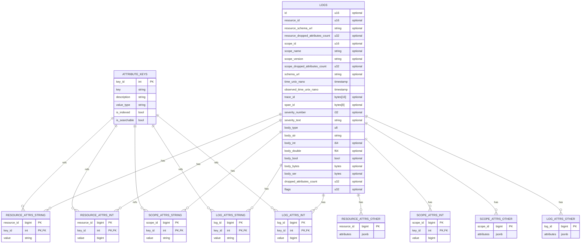
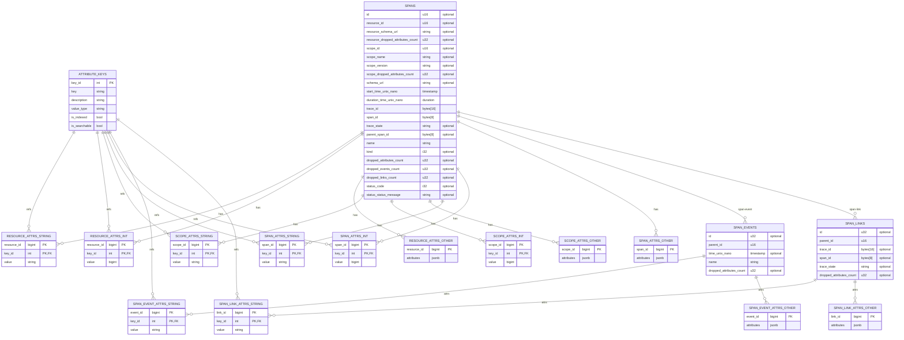

# Ollyscale Data Model

This document describes the Ollyscale data model for storing and querying OpenTelemetry (OTEL) observability data.

## Overview

The Ollyscale data model is inspired by the [OTEL Arrow Data Model](otel-arrow-data-model.md), which provides an efficient columnar representation optimized for compression and analytical queries. Our implementation adapts these concepts for PostgreSQL storage while maintaining compatibility with OTLP standards.

## Design Principles

The Ollyscale data model is designed to:

- **Optimize for analytical queries**: Support efficient time-series queries and aggregations
- **Maintain OTLP compatibility**: Preserve full semantic compatibility with OTLP protocol
- **Enable efficient storage**: Leverage PostgreSQL partitioning and compression capabilities
- **Support high cardinality**: Handle large numbers of unique attributes and metric dimensions
- **Facilitate data retention**: Enable time-based partitioning and efficient data lifecycle management

## Reference Architecture

Our data model takes inspiration from the OTEL Arrow schema, particularly:

- **Hierarchical attribute storage**: Separating resource, scope, and signal-specific attributes
- **Parent-child relationships**: Using parent IDs to establish relationships between entities
- **Type-aware attribute encoding**: Storing attributes with explicit type information
- **Temporal optimization**: Efficient handling of time-series data with Unix nanosecond timestamps

## Data Model Components

### Metrics

The metrics data model stores:

- Resource attributes (deployment environment, service identifiers)
- Scope attributes (instrumentation library information)
- Metric metadata (name, description, unit, type)
- Data points with timestamps and values
- Exemplars for detailed sampling
- Attributes at multiple levels (resource, scope, data point)

```mermaid
erDiagram
    ATTRIBUTE_KEYS ||--o{ RESOURCE_ATTRS_STRING : refs
    ATTRIBUTE_KEYS ||--o{ RESOURCE_ATTRS_INT : refs
    ATTRIBUTE_KEYS ||--o{ RESOURCE_ATTRS_DOUBLE : refs
    ATTRIBUTE_KEYS ||--o{ RESOURCE_ATTRS_BOOL : refs
    ATTRIBUTE_KEYS ||--o{ SCOPE_ATTRS_STRING : refs
    ATTRIBUTE_KEYS ||--o{ SCOPE_ATTRS_INT : refs
    METRICS ||--o{ RESOURCE_ATTRS_STRING : has
    METRICS ||--o{ RESOURCE_ATTRS_INT : has
    METRICS ||--o{ RESOURCE_ATTRS_DOUBLE : has
    METRICS ||--o{ RESOURCE_ATTRS_BOOL : has
    METRICS ||--o{ RESOURCE_ATTRS_OTHER : has
    METRICS ||--o{ SCOPE_ATTRS_STRING : has
    METRICS ||--o{ SCOPE_ATTRS_INT : has
    METRICS ||--o{ SCOPE_ATTRS_OTHER : has
    METRICS ||--o{ NUMBER_DATA_POINTS : number-dps
    NUMBER_DATA_POINTS ||--o{ NUMBER_DP_ATTRS_STRING : attrs
    NUMBER_DATA_POINTS ||--o{ NUMBER_DP_ATTRS_INT : attrs
    NUMBER_DATA_POINTS ||--o{ NUMBER_DP_ATTRS_OTHER : attrs
    NUMBER_DATA_POINTS ||--o{ NUMBER_DP_EXEMPLARS : exemplars
    NUMBER_DP_EXEMPLARS ||--o{ NUMBER_DP_EXEMPLAR_ATTRS_STRING : attrs
    NUMBER_DP_EXEMPLAR_ATTRS_STRING }o--|| ATTRIBUTE_KEYS : refs
    METRICS ||--o{ SUMMARY_DATA_POINTS : summary-dps
    SUMMARY_DATA_POINTS ||--o{ quantile : quantile
    SUMMARY_DATA_POINTS ||--o{ SUMMARY_DP_ATTRS_STRING : attrs
    SUMMARY_DATA_POINTS ||--o{ SUMMARY_DP_ATTRS_OTHER : attrs
    METRICS ||--o{ HISTOGRAM_DATA_POINTS : histogram-dps
    HISTOGRAM_DATA_POINTS ||--o{ HISTOGRAM_DP_ATTRS_STRING : attrs
    HISTOGRAM_DATA_POINTS ||--o{ HISTOGRAM_DP_ATTRS_OTHER : attrs
    HISTOGRAM_DATA_POINTS ||--o{ HISTOGRAM_DP_EXEMPLARS : exemplars
    HISTOGRAM_DP_EXEMPLARS ||--o{ HISTOGRAM_DP_EXEMPLAR_ATTRS_STRING : attrs
    METRICS ||--o{ EXP_HISTOGRAM_DATA_POINTS : exp-histogram-dps
    EXP_HISTOGRAM_DATA_POINTS ||--o{ EXP_HISTOGRAM_DP_ATTRS_STRING : attrs
    EXP_HISTOGRAM_DATA_POINTS ||--o{ EXP_HISTOGRAM_DP_EXEMPLARS : exemplars
    EXP_HISTOGRAM_DP_EXEMPLARS ||--o{ EXP_HISTOGRAM_DP_EXEMPLAR_ATTRS_STRING : attrs
    ATTRIBUTE_KEYS{
        key_id int PK
        key string
        description string
        value_type string
        is_indexed bool
        is_searchable bool
    }
    RESOURCE_ATTRS_STRING{
        resource_id bigint PK
        key_id int PK,FK
        value string
    }
    RESOURCE_ATTRS_INT{
        resource_id bigint PK
        key_id int PK,FK
        value bigint
    }
    RESOURCE_ATTRS_DOUBLE{
        resource_id bigint PK
        key_id int PK,FK
        value double
    }
    RESOURCE_ATTRS_BOOL{
        resource_id bigint PK
        key_id int PK,FK
        value bool
    }
    RESOURCE_ATTRS_OTHER{
        resource_id bigint PK
        attributes jsonb
    }
    SCOPE_ATTRS_STRING{
        scope_id bigint PK
        key_id int PK,FK
        value string
    }
    SCOPE_ATTRS_INT{
        scope_id bigint PK
        key_id int PK,FK
        value bigint
    }
    SCOPE_ATTRS_OTHER{
        scope_id bigint PK
        attributes jsonb
    }
    NUMBER_DATA_POINTS{
        id u32
        parent_id u16
        start_time_unix_nano timestamp
        time_unix_nano timestamp
        int_value i64
        double_value f64
        flags u32 "optional"
    }
    NUMBER_DP_EXEMPLARS{
        id u32 "optional"
        parent_id u32
        time_unix_nano timestamp "optional"
        int_value i64 "optional"
        double_value f64 "optional"
        span_id bytes[8] "optional"
        trace_id bytes[16] "optional"
    }
    NUMBER_DP_EXEMPLAR_ATTRS_STRING{
        exemplar_id u32 PK
        key_id int PK,FK
        value string
    }
    NUMBER_DP_ATTRS_STRING{
        dp_id u32 PK
        key_id int PK,FK
        value string
    }
    NUMBER_DP_ATTRS_INT{
        dp_id u32 PK
        key_id int PK,FK
        value bigint
    }
    NUMBER_DP_ATTRS_OTHER{
        dp_id u32 PK
        attributes jsonb
    }
    HISTOGRAM_DATA_POINTS{
        id u32 "optional"
        parent_id u16
        start_time_unix_nano timestamp "optional"
        time_unix_nano timestamp "optional"
        count u64 "optional"
        sum f64 "optional"
        bucket_counts u64 "optional"
        explicit_bounds f64 "optional"
        flags u32 "optional"
        min f64 "optional"
        max f64 "optional"
    }
    EXP_HISTOGRAM_DP_ATTRS_STRING{
        dp_id u32 PK
        key_id int PK,FK
        value string
    }
    EXP_HISTOGRAM_DP_EXEMPLAR_ATTRS_STRING{
        exemplar_id u32 PK
        key_id int PK,FK
        value string
    }
    SUMMARY_DATA_POINTS{
        id u32 "optional"
        parent_id u16
        start_time_unix_nano timestamp "optional"
        time_unix_nano timestamp "optional"
        count u64 "optional"
        sum f64 "optional"
        flags u32 "optional"
    }
    quantile{
        quantile f64 "optional"
        value f64 "optional"
    }
    SUMMARY_DP_ATTRS_STRING{
        dp_id u32 PK
        key_id int PK,FK
        value string
    }
    SUMMARY_DP_ATTRS_OTHER{
        dp_id u32 PK
        attributes jsonb
    }
    METRICS{
        id u16
        resource_id u16 "optional"
        resource_schema_url string "optional"
        resource_dropped_attributes_count u32 "optional"
        scope_id u16 "optional"
        scope_name string "optional"
        scope_version string "optional"
        scope_dropped_attributes_count u32 "optional"
        schema_url string "optional"
        metric_type u8
        name string
        description string "optional"
        unit string "optional"
        aggregation_temporality i32 "optional"
        is_monotonic bool "optional"
    }
    HISTOGRAM_DP_ATTRS_STRING{
        dp_id u32 PK
        key_id int PK,FK
        value string
    }
    HISTOGRAM_DP_ATTRS_OTHER{
        dp_id u32 PK
        attributes jsonb
    }
    HISTOGRAM_DP_EXEMPLARS{
        id u32 "optional"
        parent_id u32
        time_unix_nano timestamp "optional"
        int_value i64 "optional"
        double_value f64 "optional"
        span_id bytes[8] "optional"
        trace_id bytes[16] "optional"
    }
    HISTOGRAM_DP_EXEMPLAR_ATTRS_STRING{
        exemplar_id u32 PK
        key_id int PK,FK
        value string
    }
    EXP_HISTOGRAM_DATA_POINTS{
        id u32 "optional"
        parent_id u16
        start_time_unix_nano timestamp "optional"
        time_unix_nano timestamp "optional"
        count u64 "optional"
        sum f64 "optional"
        scale i32 "optional"
        zero_count u64 "optional"
        positive_offset i32 "optional"
        positive_bucket_counts u64 "optional"
        negative_offset i32 "optional"
        negative_bucket_counts u64 "optional"
        flags u32 "optional"
        min f64 "optional"
        max f64 "optional"
    }
    EXP_HISTOGRAM_DP_EXEMPLARS{
        id u32 "optional"
        parent_id u32
        time_unix_nano timestamp "optional"
        int_value i64 "optional"
        double_value f64 "optional"
        span_id bytes[8] "optional"
        trace_id bytes[16] "optional"
    }
```



### Logs

The logs data model stores:

- Resource and scope context
- Log records with severity and body content
- Trace correlation (trace_id, span_id)
- Flexible body types (string, number, boolean, binary, structured)
- Per-log attributes



### Traces

The traces data model stores:

- Span information (trace_id, span_id, parent relationships)
- Resource and scope context
- Span attributes, events, and links
- Status information and timing data
- Event and link attributes



## Implementation Notes

### Schema Architecture: Hybrid Star Schema with Constellation

The Ollyscale data model implements a **hybrid constellation schema** that combines:

- **Multiple fact tables** at different granularities (metrics, logs, spans, data points)
- **Shared dimension tables** (resources, scopes) across signal types
- **Hierarchical relationships** (resource → scope → signal → detail)
- **Type-specific attribute storage** for optimized queries and storage

This architecture is more sophisticated than a traditional star schema, providing multi-level analytical capabilities while maintaining efficient storage and query performance.

### PostgreSQL Adaptation

While the [OTEL Arrow Data Model](otel-arrow-data-model.md) uses Arrow/Parquet columnar formats, Ollyscale adapts these concepts for PostgreSQL:

- **Table partitioning**: Time-based partitioning for efficient data lifecycle management
- **Hybrid attribute storage**: Combination of typed tables and JSONB for flexibility
- **Indexes for performance**: Strategic indexes on commonly queried fields
- **Materialized views**: Pre-aggregated views for common query patterns

### Attribute Storage Optimization

#### The Challenge

OpenTelemetry attributes can have high cardinality and variable types. Storing all attributes in a generic EAV (Entity-Attribute-Value) structure or JSONB leads to:

- Poor query performance on frequently-accessed attributes
- Inefficient storage with many NULL columns
- Difficulty maintaining indexes on dynamic attributes
- Limited ability to control which attributes are "searchable"

#### Hybrid Storage Strategy

Ollyscale uses a **hybrid approach** that optimizes for both common and rare attributes:

**1. Well-Known Attribute Dimension Table**

```sql
-- Registry of attribute keys with metadata
CREATE TABLE attribute_keys (
  key_id SERIAL PRIMARY KEY,
  key TEXT UNIQUE NOT NULL,
  description TEXT,
  value_type TEXT NOT NULL, -- 'string', 'int', 'double', 'bool', 'bytes'
  is_indexed BOOLEAN DEFAULT false,
  is_searchable BOOLEAN DEFAULT false,
  created_at TIMESTAMPTZ DEFAULT NOW()
);

-- Pre-populate with OTEL semantic conventions
INSERT INTO attribute_keys (key, value_type, is_indexed, is_searchable) VALUES
  ('service.name', 'string', true, true),
  ('deployment.environment', 'string', true, true),
  ('service.instance.id', 'string', true, true),
  ('telemetry.sdk.version', 'string', false, false);
```

**2. Type-Specific Attribute Tables**

Instead of a single table with multiple optional columns, use separate tables per type:

```sql
-- String attributes (most common)
CREATE TABLE resource_attrs_string (
  resource_id BIGINT NOT NULL,
  key_id INT NOT NULL REFERENCES attribute_keys(key_id),
  value TEXT NOT NULL,
  PRIMARY KEY (resource_id, key_id)
);
CREATE INDEX idx_resource_attrs_string_value ON resource_attrs_string(key_id, value);

-- Integer attributes
CREATE TABLE resource_attrs_int (
  resource_id BIGINT NOT NULL,
  key_id INT NOT NULL REFERENCES attribute_keys(key_id),
  value BIGINT NOT NULL,
  PRIMARY KEY (resource_id, key_id)
);
CREATE INDEX idx_resource_attrs_int_value ON resource_attrs_int(key_id, value);

-- Double attributes
CREATE TABLE resource_attrs_double (
  resource_id BIGINT NOT NULL,
  key_id INT NOT NULL REFERENCES attribute_keys(key_id),
  value DOUBLE PRECISION NOT NULL,
  PRIMARY KEY (resource_id, key_id)
);

-- Boolean attributes
CREATE TABLE resource_attrs_bool (
  resource_id BIGINT NOT NULL,
  key_id INT NOT NULL REFERENCES attribute_keys(key_id),
  value BOOLEAN NOT NULL,
  PRIMARY KEY (resource_id, key_id)
);

-- Bytes attributes
CREATE TABLE resource_attrs_bytes (
  resource_id BIGINT NOT NULL,
  key_id INT NOT NULL REFERENCES attribute_keys(key_id),
  value BYTEA NOT NULL,
  PRIMARY KEY (resource_id, key_id)
);
```

**3. Catch-All for Rare Attributes**

```sql
-- JSONB storage for attributes not in the registry
CREATE TABLE resource_attrs_other (
  resource_id BIGINT PRIMARY KEY,
  attributes JSONB NOT NULL DEFAULT '{}'
);
CREATE INDEX idx_resource_attrs_other_gin ON resource_attrs_other USING GIN(attributes);
```

**4. Unified View for Application Layer**

```sql
-- Unified view presenting all attributes together
CREATE VIEW resource_attrs_unified AS
SELECT
  resource_id,
  ak.key,
  'string' as type,
  ras.value as str_value,
  NULL::bigint as int_value,
  NULL::double precision as double_value,
  NULL::boolean as bool_value,
  NULL::bytea as bytes_value
FROM resource_attrs_string ras
JOIN attribute_keys ak USING (key_id)

UNION ALL

SELECT
  resource_id,
  ak.key,
  'int' as type,
  NULL,
  rai.value,
  NULL,
  NULL,
  NULL
FROM resource_attrs_int rai
JOIN attribute_keys ak USING (key_id)

UNION ALL

SELECT
  resource_id,
  ak.key,
  'double' as type,
  NULL,
  NULL,
  rad.value,
  NULL,
  NULL
FROM resource_attrs_double rad
JOIN attribute_keys ak USING (key_id)

UNION ALL

SELECT
  resource_id,
  ak.key,
  'bool' as type,
  NULL,
  NULL,
  NULL,
  rab.value,
  NULL
FROM resource_attrs_bool rab
JOIN attribute_keys ak USING (key_id)

UNION ALL

SELECT
  resource_id,
  ak.key,
  'bytes' as type,
  NULL,
  NULL,
  NULL,
  NULL,
  rab.value
FROM resource_attrs_bytes rab
JOIN attribute_keys ak USING (key_id)

UNION ALL

-- Expand JSONB for rare attributes
SELECT
  resource_id,
  key,
  jsonb_typeof(value) as type,
  CASE WHEN jsonb_typeof(value) = 'string' THEN value #>> '{}' END,
  CASE WHEN jsonb_typeof(value) = 'number' THEN (value #>> '{}')::bigint END,
  CASE WHEN jsonb_typeof(value) = 'number' THEN (value #>> '{}')::double precision END,
  CASE WHEN jsonb_typeof(value) = 'boolean' THEN (value #>> '{}')::boolean END,
  NULL
FROM resource_attrs_other,
  jsonb_each(attributes);
```

#### Benefits of This Approach

1. **Query Performance**: Direct index lookups on commonly-queried attributes without JSONB traversal
2. **Storage Efficiency**:
   - No NULL columns wasting space
   - Better compression per type
   - Common keys stored once as integers
3. **Cardinality Control**: Explicitly manage which attributes are indexed and searchable
4. **Type Safety**: Native PostgreSQL types with proper constraints
5. **Statistics Quality**: PostgreSQL can maintain accurate statistics on dedicated columns
6. **Flexibility**: New rare attributes automatically work via JSONB catch-all
7. **Backward Compatibility**: View layer provides seamless access to all attributes

#### Attribute Lifecycle Management

```sql
-- Promote frequently-queried attributes from JSONB to dedicated tables
CREATE PROCEDURE promote_attribute(p_key TEXT, p_value_type TEXT)
LANGUAGE plpgsql AS $$
BEGIN
  -- Add to registry
  INSERT INTO attribute_keys (key, value_type, is_indexed, is_searchable)
  VALUES (p_key, p_value_type, true, true)
  ON CONFLICT (key) DO UPDATE SET is_indexed = true, is_searchable = true;

  -- Migrate existing data from JSONB to typed table
  -- (Migration logic here)

  -- Remove from JSONB storage
  UPDATE resource_attrs_other
  SET attributes = attributes - p_key
  WHERE attributes ? p_key;
END;
$$;
```

### Schema Pattern Application

This hybrid storage pattern applies to:

- **Resource attributes**: Service identity, deployment context
- **Scope attributes**: Instrumentation library metadata  
- **Metric attributes**: Metric-specific dimensions
- **Log attributes**: Log-specific context
- **Span attributes**: Request/operation metadata
- **Event attributes**: Span event details
- **Link attributes**: Span link metadata

Each attribute level can have its own set of promoted keys based on query patterns and cardinality.

### Schema Evolution

The data model is designed to support schema evolution:

- New attribute types can be added without schema changes (via JSONB catch-all)
- Frequently-accessed attributes can be promoted to dedicated tables dynamically
- Resource and scope relationships allow for efficient deduplication
- Schema versioning through `schema_url` fields
- Views abstract storage details from application layer

## See Also

- [OTEL Arrow Data Model Reference](otel-arrow-data-model.md) - The source reference model
- [Database Connection Pooling](database-connection-pooling.md) - Connection management
- [Partition Management](partition-management.md) - Data lifecycle management
- [Postgres Infrastructure](postgres-infrastructure.md) - Database infrastructure details
