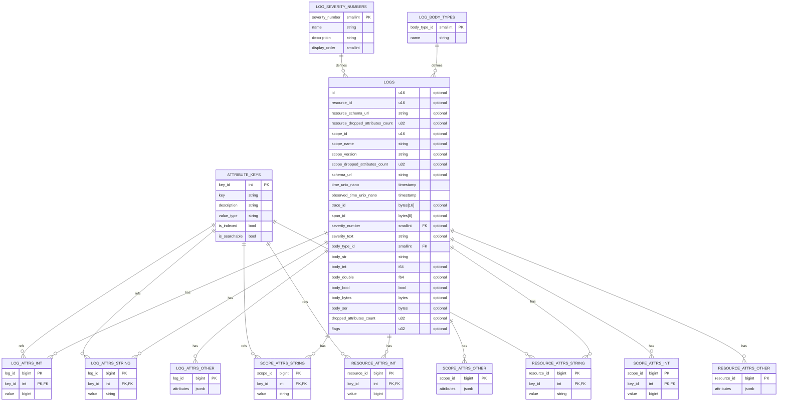

# Ollyscale Data Model

This document describes the Ollyscale data model for storing and querying OpenTelemetry (OTEL) observability data.

## Overview

The Ollyscale data model is inspired by the [OTEL Arrow Data Model](otel-arrow-data-model.md), which
provides an efficient columnar representation optimized for compression and analytical queries. Our
implementation adapts these concepts for PostgreSQL storage while maintaining compatibility with OTLP
standards.

## Design Principles

The Ollyscale data model is designed to:

- **Optimize for analytical queries**: Support efficient time-series queries and aggregations
- **Maintain OTLP compatibility**: Preserve full semantic compatibility with OTLP protocol
- **Enable efficient storage**: Leverage PostgreSQL partitioning and compression capabilities
- **Support high cardinality**: Handle large numbers of unique attributes and metric dimensions
- **Facilitate data retention**: Enable time-based partitioning and efficient data lifecycle management

## Reference Architecture

Our data model takes inspiration from the OTEL Arrow schema, particularly:

- **Hierarchical attribute storage**: Separating resource, scope, and signal-specific attributes
- **Parent-child relationships**: Using parent IDs to establish relationships between entities
- **Type-aware attribute encoding**: Storing attributes with explicit type information
- **Temporal optimization**: Efficient handling of time-series data with Unix nanosecond timestamps

## Data Model Components

### Metrics

The metrics data model stores:

- Resource attributes (deployment environment, service identifiers)
- Scope attributes (instrumentation library information)
- Metric metadata (name, description, unit, type)
- Data points with timestamps and values
- Exemplars for detailed sampling
- Attributes at multiple levels (resource, scope, data point)

```mermaid
erDiagram
    ATTRIBUTE_KEYS ||--o{ RESOURCE_ATTRS_STRING : refs
    ATTRIBUTE_KEYS ||--o{ RESOURCE_ATTRS_INT : refs
    ATTRIBUTE_KEYS ||--o{ RESOURCE_ATTRS_DOUBLE : refs
    ATTRIBUTE_KEYS ||--o{ RESOURCE_ATTRS_BOOL : refs
    ATTRIBUTE_KEYS ||--o{ SCOPE_ATTRS_STRING : refs
    ATTRIBUTE_KEYS ||--o{ SCOPE_ATTRS_INT : refs
    METRIC_TYPES ||--o{ METRICS_DIM : defines
    AGGREGATION_TEMPORALITIES ||--o{ METRICS_DIM : defines
    METRICS_DIM ||--o{ METRICS : defines
    METRICS ||--o{ RESOURCE_ATTRS_STRING : has
    METRICS ||--o{ RESOURCE_ATTRS_INT : has
    METRICS ||--o{ RESOURCE_ATTRS_DOUBLE : has
    METRICS ||--o{ RESOURCE_ATTRS_BOOL : has
    METRICS ||--o{ RESOURCE_ATTRS_OTHER : has
    METRICS ||--o{ SCOPE_ATTRS_STRING : has
    METRICS ||--o{ SCOPE_ATTRS_INT : has
    METRICS ||--o{ SCOPE_ATTRS_OTHER : has
    METRICS ||--o{ NUMBER_DATA_POINTS : number-dps
    NUMBER_DATA_POINTS ||--o{ NUMBER_DP_ATTRS_STRING : attrs
    NUMBER_DATA_POINTS ||--o{ NUMBER_DP_ATTRS_INT : attrs
    NUMBER_DATA_POINTS ||--o{ NUMBER_DP_ATTRS_OTHER : attrs
    NUMBER_DATA_POINTS ||--o{ NUMBER_DP_EXEMPLARS : exemplars
    NUMBER_DP_EXEMPLARS ||--o{ NUMBER_DP_EXEMPLAR_ATTRS_STRING : attrs
    NUMBER_DP_EXEMPLAR_ATTRS_STRING }o--|| ATTRIBUTE_KEYS : refs
    METRICS ||--o{ SUMMARY_DATA_POINTS : summary-dps
    SUMMARY_DATA_POINTS ||--o{ quantile : quantile
    SUMMARY_DATA_POINTS ||--o{ SUMMARY_DP_ATTRS_STRING : attrs
    SUMMARY_DATA_POINTS ||--o{ SUMMARY_DP_ATTRS_OTHER : attrs
    METRICS ||--o{ HISTOGRAM_DATA_POINTS : histogram-dps
    HISTOGRAM_DATA_POINTS ||--o{ HISTOGRAM_DP_ATTRS_STRING : attrs
    HISTOGRAM_DATA_POINTS ||--o{ HISTOGRAM_DP_ATTRS_OTHER : attrs
    HISTOGRAM_DATA_POINTS ||--o{ HISTOGRAM_DP_EXEMPLARS : exemplars
    HISTOGRAM_DP_EXEMPLARS ||--o{ HISTOGRAM_DP_EXEMPLAR_ATTRS_STRING : attrs
    METRICS ||--o{ EXP_HISTOGRAM_DATA_POINTS : exp-histogram-dps
    EXP_HISTOGRAM_DATA_POINTS ||--o{ EXP_HISTOGRAM_DP_ATTRS_STRING : attrs
    EXP_HISTOGRAM_DATA_POINTS ||--o{ EXP_HISTOGRAM_DP_EXEMPLARS : exemplars
    EXP_HISTOGRAM_DP_EXEMPLARS ||--o{ EXP_HISTOGRAM_DP_EXEMPLAR_ATTRS_STRING : attrs
    ATTRIBUTE_KEYS{
        key_id int PK
        key string
        description string
        value_type string
        is_indexed bool
        is_searchable bool
    }
    RESOURCE_ATTRS_STRING{
        resource_id bigint PK
        key_id int PK,FK
        value string
    }
    RESOURCE_ATTRS_INT{
        resource_id bigint PK
        key_id int PK,FK
        value bigint
    }
    RESOURCE_ATTRS_DOUBLE{
        resource_id bigint PK
        key_id int PK,FK
        value double
    }
    RESOURCE_ATTRS_BOOL{
        resource_id bigint PK
        key_id int PK,FK
        value bool
    }
    RESOURCE_ATTRS_OTHER{
        resource_id bigint PK
        attributes jsonb
    }
    SCOPE_ATTRS_STRING{
        scope_id bigint PK
        key_id int PK,FK
        value string
    }
    SCOPE_ATTRS_INT{
        scope_id bigint PK
        key_id int PK,FK
        value bigint
    }
    SCOPE_ATTRS_OTHER{
        scope_id bigint PK
        attributes jsonb
    }
    NUMBER_DATA_POINTS{
        id u32
        parent_id u16
        start_time_unix_nano timestamp
        time_unix_nano timestamp
        int_value i64
        double_value f64
        flags u32 "optional"
    }
    NUMBER_DP_EXEMPLARS{
        id u32 "optional"
        parent_id u32
        time_unix_nano timestamp "optional"
        int_value i64 "optional"
        double_value f64 "optional"
        span_id bytes[8] "optional"
        trace_id bytes[16] "optional"
    }
    NUMBER_DP_EXEMPLAR_ATTRS_STRING{
        exemplar_id u32 PK
        key_id int PK,FK
        value string
    }
    NUMBER_DP_ATTRS_STRING{
        dp_id u32 PK
        key_id int PK,FK
        value string
    }
    NUMBER_DP_ATTRS_INT{
        dp_id u32 PK
        key_id int PK,FK
        value bigint
    }
    NUMBER_DP_ATTRS_OTHER{
        dp_id u32 PK
        attributes jsonb
    }
    HISTOGRAM_DATA_POINTS{
        id u32 "optional"
        parent_id u16
        start_time_unix_nano timestamp "optional"
        time_unix_nano timestamp "optional"
        count u64 "optional"
        sum f64 "optional"
        bucket_counts u64 "optional"
        explicit_bounds f64 "optional"
        flags u32 "optional"
        min f64 "optional"
        max f64 "optional"
    }
    EXP_HISTOGRAM_DP_ATTRS_STRING{
        dp_id u32 PK
        key_id int PK,FK
        value string
    }
    EXP_HISTOGRAM_DP_EXEMPLAR_ATTRS_STRING{
        exemplar_id u32 PK
        key_id int PK,FK
        value string
    }
    SUMMARY_DATA_POINTS{
        id u32 "optional"
        parent_id u16
        start_time_unix_nano timestamp "optional"
        time_unix_nano timestamp "optional"
        count u64 "optional"
        sum f64 "optional"
        flags u32 "optional"
    }
    quantile{
        quantile f64 "optional"
        value f64 "optional"
    }
    SUMMARY_DP_ATTRS_STRING{
        dp_id u32 PK
        key_id int PK,FK
        value string
    }
    SUMMARY_DP_ATTRS_OTHER{
        dp_id u32 PK
        attributes jsonb
    }
    METRIC_TYPES{
        metric_type_id smallint PK
        name string
        description string
    }
    AGGREGATION_TEMPORALITIES{
        temporality_id smallint PK
        name string
        description string
    }
    METRICS_DIM{
        metric_id bigint PK
        metric_hash varchar64
        metric_identity_hash varchar64
        name string
        metric_type_id smallint FK
        unit string
        aggregation_temporality_id smallint FK
        is_monotonic bool
        description string
        schema_url string
        first_seen timestamptz
        last_seen timestamptz
    }
    METRICS{
        id u16
        metric_id bigint FK
        resource_id u16 "optional"
        scope_id u16 "optional"
    }
    HISTOGRAM_DP_ATTRS_STRING{
        dp_id u32 PK
        key_id int PK,FK
        value string
    }
    HISTOGRAM_DP_ATTRS_OTHER{
        dp_id u32 PK
        attributes jsonb
    }
    HISTOGRAM_DP_EXEMPLARS{
        id u32 "optional"
        parent_id u32
        time_unix_nano timestamp "optional"
        int_value i64 "optional"
        double_value f64 "optional"
        span_id bytes[8] "optional"
        trace_id bytes[16] "optional"
    }
    HISTOGRAM_DP_EXEMPLAR_ATTRS_STRING{
        exemplar_id u32 PK
        key_id int PK,FK
        value string
    }
    EXP_HISTOGRAM_DATA_POINTS{
        id u32 "optional"
        parent_id u16
        start_time_unix_nano timestamp "optional"
        time_unix_nano timestamp "optional"
        count u64 "optional"
        sum f64 "optional"
        scale i32 "optional"
        zero_count u64 "optional"
        positive_offset i32 "optional"
        positive_bucket_counts u64 "optional"
        negative_offset i32 "optional"
        negative_bucket_counts u64 "optional"
        flags u32 "optional"
        min f64 "optional"
        max f64 "optional"
    }
    EXP_HISTOGRAM_DP_EXEMPLARS{
        id u32 "optional"
        parent_id u32
        time_unix_nano timestamp "optional"
        int_value i64 "optional"
        double_value f64 "optional"
        span_id bytes[8] "optional"
        trace_id bytes[16] "optional"
    }
```



### Logs

The logs data model stores:

- Resource and scope context
- Log records with severity and body content
- Trace correlation (trace_id, span_id)
- Flexible body types (string, number, boolean, binary, structured)
- Per-log attributes



### Traces

The traces data model stores:

- Span information (trace_id, span_id, parent relationships)
- Resource and scope context
- Span attributes, events, and links
- Status information and timing data
- Event and link attributes

```mermaid
erDiagram
    ATTRIBUTE_KEYS ||--o{ RESOURCE_ATTRS_STRING : refs
    ATTRIBUTE_KEYS ||--o{ RESOURCE_ATTRS_INT : refs
    ATTRIBUTE_KEYS ||--o{ SCOPE_ATTRS_STRING : refs
    ATTRIBUTE_KEYS ||--o{ SPAN_ATTRS_STRING : refs
    ATTRIBUTE_KEYS ||--o{ SPAN_ATTRS_INT : refs
    ATTRIBUTE_KEYS ||--o{ SPAN_EVENT_ATTRS_STRING : refs
    ATTRIBUTE_KEYS ||--o{ SPAN_LINK_ATTRS_STRING : refs
    SPAN_KINDS ||--o{ SPANS : defines
    STATUS_CODES ||--o{ SPANS : defines
    SPANS ||--o{ RESOURCE_ATTRS_STRING : has
    SPANS ||--o{ RESOURCE_ATTRS_INT : has
    SPANS ||--o{ RESOURCE_ATTRS_OTHER : has
    SPANS ||--o{ SCOPE_ATTRS_STRING : has
    SPANS ||--o{ SCOPE_ATTRS_INT : has
    SPANS ||--o{ SCOPE_ATTRS_OTHER : has
    SPANS ||--o{ SPAN_ATTRS_STRING : has
    SPANS ||--o{ SPAN_ATTRS_INT : has
    SPANS ||--o{ SPAN_ATTRS_OTHER : has
    SPANS ||--o{ SPAN_EVENTS : span-event
    SPANS ||--o{ SPAN_LINKS : span-link
    SPAN_EVENTS ||--o{ SPAN_EVENT_ATTRS_STRING : attrs
    SPAN_EVENTS ||--o{ SPAN_EVENT_ATTRS_OTHER : attrs
    SPAN_LINKS ||--o{ SPAN_LINK_ATTRS_STRING : attrs
    SPAN_LINKS ||--o{ SPAN_LINK_ATTRS_OTHER : attrs

    ATTRIBUTE_KEYS{
        key_id int PK
        key string
        description string
        value_type string
        is_indexed bool
        is_searchable bool
    }
    RESOURCE_ATTRS_STRING{
        resource_id bigint PK
        key_id int PK,FK
        value string
    }
    RESOURCE_ATTRS_INT{
        resource_id bigint PK
        key_id int PK,FK
        value bigint
    }
    RESOURCE_ATTRS_OTHER{
        resource_id bigint PK
        attributes jsonb
    }
    SCOPE_ATTRS_STRING{
        scope_id bigint PK
        key_id int PK,FK
        value string
    }
    SCOPE_ATTRS_INT{
        scope_id bigint PK
        key_id int PK,FK
        value bigint
    }
    SCOPE_ATTRS_OTHER{
        scope_id bigint PK
        attributes jsonb
    }
    SPAN_ATTRS_STRING{
        span_id bigint PK
        key_id int PK,FK
        value string
    }
    SPAN_ATTRS_INT{
        span_id bigint PK
        key_id int PK,FK
        value bigint
    }
    SPAN_ATTRS_OTHER{
        span_id bigint PK
        attributes jsonb
    }
    SPAN_EVENT_ATTRS_STRING{
        event_id bigint PK
        key_id int PK,FK
        value string
    }
    SPAN_EVENT_ATTRS_OTHER{
        event_id bigint PK
        attributes jsonb
    }
    SPAN_LINK_ATTRS_STRING{
        link_id bigint PK
        key_id int PK,FK
        value string
    }
    SPAN_LINK_ATTRS_OTHER{
        link_id bigint PK
        attributes jsonb
    }
    SPAN_KINDS{
        kind_id smallint PK
        name string
        description string
    }
    STATUS_CODES{
        status_code_id smallint PK
        name string
        description string
    }
    SPANS{
        id u16 "optional"
        resource_id u16 "optional"
        resource_schema_url string "optional"
        resource_dropped_attributes_count u32 "optional"
        scope_id u16 "optional"
        scope_name string "optional"
        scope_version string "optional"
        scope_dropped_attributes_count u32 "optional"
        schema_url string "optional"
        start_time_unix_nano timestamp
        duration_time_unix_nano duration
        trace_id bytes[16]
        span_id bytes[8]
        trace_state string "optional"
        parent_span_id bytes[8] "optional"
        name string
        kind_id smallint FK "optional"
        dropped_attributes_count u32 "optional"
        dropped_events_count u32 "optional"
        dropped_links_count u32 "optional"
        status_code_id smallint FK "optional"
        status_message string "optional"
    }
    SPAN_EVENTS{
        id u32 "optional"
        parent_id u16
        time_unix_nano timestamp "optional"
        name string
        dropped_attributes_count u32 "optional"
    }
    SPAN_LINKS{
        id u32 "optional"
        parent_id u16
        trace_id bytes[16] "optional"
        span_id bytes[8] "optional"
        trace_state string "optional"
        dropped_attributes_count u32 "optional"
    }
```



## Implementation Notes

### Schema Architecture: Hybrid Star Schema with Constellation

The Ollyscale data model implements a **hybrid constellation schema** that combines:

- **Multiple fact tables** at different granularities (metrics, logs, spans, data points)
- **Shared dimension tables** (resources, scopes) across signal types
- **Hierarchical relationships** (resource → scope → signal → detail)
- **Type-specific attribute storage** for optimized queries and storage

This architecture is more sophisticated than a traditional star schema, providing multi-level
analytical capabilities while maintaining efficient storage and query performance.

### PostgreSQL Adaptation

While the [OTEL Arrow Data Model](otel-arrow-data-model.md) uses Arrow/Parquet columnar formats,
Ollyscale adapts these concepts for PostgreSQL:

- **Table partitioning**: Time-based partitioning for efficient data lifecycle management
- **Hybrid attribute storage**: Combination of typed tables and JSONB for flexibility
- **Indexes for performance**: Strategic indexes on commonly queried fields
- **Materialized views**: Pre-aggregated views for common query patterns

### Attribute Storage Optimization

#### The Challenge

OpenTelemetry attributes can have high cardinality and variable types. Storing all attributes in a
generic EAV (Entity-Attribute-Value) structure or JSONB leads to:

- Poor query performance on frequently-accessed attributes
- Inefficient storage with many NULL columns
- Difficulty maintaining indexes on dynamic attributes
- Limited ability to control which attributes are "searchable"

#### Hybrid Storage Strategy

Ollyscale uses a **hybrid approach** that optimizes for both common and rare attributes:

#### 1. Well-Known Attribute Dimension Table

```sql
-- Registry of attribute keys with metadata
CREATE TABLE attribute_keys (
  key_id SERIAL PRIMARY KEY,
  key TEXT UNIQUE NOT NULL,
  description TEXT,
  value_type TEXT NOT NULL, -- 'string', 'int', 'double', 'bool', 'bytes'
  is_indexed BOOLEAN DEFAULT false,
  is_searchable BOOLEAN DEFAULT false,
  created_at TIMESTAMPTZ DEFAULT NOW()
);

-- Pre-populate with OTEL semantic conventions
INSERT INTO attribute_keys (key, value_type, is_indexed, is_searchable) VALUES
  ('service.name', 'string', true, true),
  ('deployment.environment', 'string', true, true),
  ('service.instance.id', 'string', true, true),
  ('telemetry.sdk.version', 'string', false, false);
```

#### 2. Type-Specific Attribute Tables

Instead of a single table with multiple optional columns, use separate tables per type:

```sql
-- String attributes (most common)
CREATE TABLE resource_attrs_string (
  resource_id BIGINT NOT NULL,
  key_id INT NOT NULL REFERENCES attribute_keys(key_id),
  value TEXT NOT NULL,
  PRIMARY KEY (resource_id, key_id)
);
CREATE INDEX idx_resource_attrs_string_value ON resource_attrs_string(key_id, value);

-- Integer attributes
CREATE TABLE resource_attrs_int (
  resource_id BIGINT NOT NULL,
  key_id INT NOT NULL REFERENCES attribute_keys(key_id),
  value BIGINT NOT NULL,
  PRIMARY KEY (resource_id, key_id)
);
CREATE INDEX idx_resource_attrs_int_value ON resource_attrs_int(key_id, value);

-- Double attributes
CREATE TABLE resource_attrs_double (
  resource_id BIGINT NOT NULL,
  key_id INT NOT NULL REFERENCES attribute_keys(key_id),
  value DOUBLE PRECISION NOT NULL,
  PRIMARY KEY (resource_id, key_id)
);

-- Boolean attributes
CREATE TABLE resource_attrs_bool (
  resource_id BIGINT NOT NULL,
  key_id INT NOT NULL REFERENCES attribute_keys(key_id),
  value BOOLEAN NOT NULL,
  PRIMARY KEY (resource_id, key_id)
);

-- Bytes attributes
CREATE TABLE resource_attrs_bytes (
  resource_id BIGINT NOT NULL,
  key_id INT NOT NULL REFERENCES attribute_keys(key_id),
  value BYTEA NOT NULL,
  PRIMARY KEY (resource_id, key_id)
);
```

#### 3. Catch-All for Rare Attributes

```sql
-- JSONB storage for attributes not in the registry
CREATE TABLE resource_attrs_other (
  resource_id BIGINT PRIMARY KEY,
  attributes JSONB NOT NULL DEFAULT '{}'
);
CREATE INDEX idx_resource_attrs_other_gin ON resource_attrs_other USING GIN(attributes);
```

#### 4. Unified View for Application Layer

```sql
-- Unified view presenting all attributes together
CREATE VIEW resource_attrs_unified AS
SELECT
  resource_id,
  ak.key,
  'string' as type,
  ras.value as str_value,
  NULL::bigint as int_value,
  NULL::double precision as double_value,
  NULL::boolean as bool_value,
  NULL::bytea as bytes_value
FROM resource_attrs_string ras
JOIN attribute_keys ak USING (key_id)

UNION ALL

SELECT
  resource_id,
  ak.key,
  'int' as type,
  NULL,
  rai.value,
  NULL,
  NULL,
  NULL
FROM resource_attrs_int rai
JOIN attribute_keys ak USING (key_id)

UNION ALL

SELECT
  resource_id,
  ak.key,
  'double' as type,
  NULL,
  NULL,
  rad.value,
  NULL,
  NULL
FROM resource_attrs_double rad
JOIN attribute_keys ak USING (key_id)

UNION ALL

SELECT
  resource_id,
  ak.key,
  'bool' as type,
  NULL,
  NULL,
  NULL,
  rab.value,
  NULL
FROM resource_attrs_bool rab
JOIN attribute_keys ak USING (key_id)

UNION ALL

SELECT
  resource_id,
  ak.key,
  'bytes' as type,
  NULL,
  NULL,
  NULL,
  NULL,
  rab.value
FROM resource_attrs_bytes rab
JOIN attribute_keys ak USING (key_id)

UNION ALL

-- Expand JSONB for rare attributes
SELECT
  resource_id,
  key,
  jsonb_typeof(value) as type,
  CASE WHEN jsonb_typeof(value) = 'string' THEN value #>> '{}' END,
  CASE WHEN jsonb_typeof(value) = 'number' THEN (value #>> '{}')::bigint END,
  CASE WHEN jsonb_typeof(value) = 'number' THEN (value #>> '{}')::double precision END,
  CASE WHEN jsonb_typeof(value) = 'boolean' THEN (value #>> '{}')::boolean END,
  NULL
FROM resource_attrs_other,
  jsonb_each(attributes);
```

#### Benefits of This Approach

1. **Query Performance**: Direct index lookups on commonly-queried attributes without JSONB traversal
2. **Storage Efficiency**:
   - No NULL columns wasting space
   - Better compression per type
   - Common keys stored once as integers
3. **Cardinality Control**: Explicitly manage which attributes are indexed and searchable
4. **Type Safety**: Native PostgreSQL types with proper constraints
5. **Statistics Quality**: PostgreSQL can maintain accurate statistics on dedicated columns
6. **Flexibility**: New rare attributes automatically work via JSONB catch-all
7. **Backward Compatibility**: View layer provides seamless access to all attributes

#### Attribute Lifecycle Management

```sql
-- Promote frequently-queried attributes from JSONB to dedicated tables
CREATE PROCEDURE promote_attribute(p_key TEXT, p_value_type TEXT)
LANGUAGE plpgsql AS $$
BEGIN
  -- Add to registry
  INSERT INTO attribute_keys (key, value_type, is_indexed, is_searchable)
  VALUES (p_key, p_value_type, true, true)
  ON CONFLICT (key) DO UPDATE SET is_indexed = true, is_searchable = true;

  -- Migrate existing data from JSONB to typed table
  -- (Migration logic here)

  -- Remove from JSONB storage
  UPDATE resource_attrs_other
  SET attributes = attributes - p_key
  WHERE attributes ? p_key;
END;
$$;
```

### Metric Dimension Deduplication

#### The Challenge

Metric metadata (name, type, unit, aggregation_temporality, is_monotonic) has low cardinality but gets
repeated for every data point batch. Additionally, the **description field is problematic**:

- Multiple sources may use different wording for semantically identical descriptions
- Different teams may provide conflicting descriptions for the same metric
- Rarely, the same metric name might represent truly different metrics with different descriptions

#### Solution: Metric Dimension with Description Variants

```sql
CREATE TABLE metrics_dim (
  metric_id BIGSERIAL PRIMARY KEY,

  -- Full hash including description (allows multiple rows per metric identity)
  metric_hash VARCHAR(64) NOT NULL UNIQUE,

  -- Identity hash excluding description (groups variants together)
  metric_identity_hash VARCHAR(64) NOT NULL,

  -- Metric identification (stable across description changes)
  name TEXT NOT NULL,
  metric_type_id SMALLINT NOT NULL REFERENCES metric_types(metric_type_id),
  unit TEXT,
  aggregation_temporality_id SMALLINT REFERENCES aggregation_temporalities(temporality_id),
  is_monotonic BOOLEAN,

  -- Description can vary for same metric identity
  description TEXT,

  -- Temporal tracking
  first_seen TIMESTAMPTZ DEFAULT NOW(),
  last_seen TIMESTAMPTZ DEFAULT NOW(),

  -- Schema versioning
  schema_url TEXT
);

-- Index for metric identity lookups (groups all description variants)
CREATE INDEX idx_metrics_dim_identity ON metrics_dim(metric_identity_hash);
CREATE INDEX idx_metrics_dim_name ON metrics_dim(name);
```

#### Upsert Logic: Allow Multiple Descriptions

```python
def get_or_create_metric(name, type_id, unit, agg_temp_id, is_monotonic, description, schema_url):
    # Hash 1: Identity (without description) - for grouping variants
    metric_identity_hash = compute_hash({
        'name': name,
        'type_id': type_id,
        'unit': unit,
        'aggregation_temporality_id': agg_temp_id,
        'is_monotonic': is_monotonic
    })

    # Hash 2: Full hash (with description) - unique per variant
    metric_hash = compute_hash({
        'name': name,
        'type_id': type_id,
        'unit': unit,
        'aggregation_temporality_id': agg_temp_id,
        'is_monotonic': is_monotonic,
        'description': description or ''  # Include description in hash
    })

    with db.cursor() as cur:
        cur.execute("""
            INSERT INTO metrics_dim (
                metric_hash, metric_identity_hash,
                name, metric_type_id, unit,
                aggregation_temporality_id, is_monotonic,
                description, schema_url,
                first_seen, last_seen
            )
            VALUES (%s, %s, %s, %s, %s, %s, %s, %s, %s, NOW(), NOW())
            ON CONFLICT (metric_hash) DO UPDATE SET
                last_seen = NOW(),
                schema_url = COALESCE(EXCLUDED.schema_url, metrics_dim.schema_url)
            RETURNING metric_id
        """, (
            metric_hash, metric_identity_hash,
            name, type_id, unit, agg_temp_id, is_monotonic,
            description, schema_url
        ))

        metric_id = cur.fetchone()[0]
        return metric_id
```

#### Benefits

1. **Storage Efficiency**: Metric metadata stored once per unique variant instead of per data point
2. **Description Preservation**: All description variants are preserved for future analysis
3. **Metric Catalog**: Easy to query "what metrics exist" and see all description variants
4. **Alias Management Ready**: Can later build views/procedures to merge semantically equivalent descriptions
5. **Temporal Tracking**: Know when each metric variant first/last appeared

#### Future: Metric Alias Management

To handle description variants, a future enhancement could add:

```sql
-- Table to map metric variants to canonical metric
CREATE TABLE metric_aliases (
  canonical_metric_id BIGINT REFERENCES metrics_dim(metric_id),
  alias_metric_id BIGINT REFERENCES metrics_dim(metric_id),
  reason TEXT,  -- 'same_meaning', 'typo_fix', 'translation', etc.
  created_by TEXT,
  created_at TIMESTAMPTZ DEFAULT NOW(),
  PRIMARY KEY (canonical_metric_id, alias_metric_id)
);

-- View that resolves aliases
CREATE VIEW metrics_dim_resolved AS
SELECT
  COALESCE(ma.canonical_metric_id, md.metric_id) as resolved_metric_id,
  md.*
FROM metrics_dim md
LEFT JOIN metric_aliases ma ON md.metric_id = ma.alias_metric_id;
```

#### Example: Finding Description Variants

```sql
-- Find all description variants for a metric identity
SELECT
  metric_id,
  name,
  description,
  first_seen,
  last_seen,
  COUNT(*) OVER (PARTITION BY metric_identity_hash) as variant_count
FROM metrics_dim
WHERE name = 'http.server.request.duration'
ORDER BY first_seen;

-- Result:
-- metric_id | name                          | description                           | variant_count
-- 101       | http.server.request.duration  | Duration of HTTP requests             | 3
-- 102       | http.server.request.duration  | Duration of HTTP server requests      | 3  
-- 103       | http.server.request.duration  | Time taken to process HTTP requests   | 3
```

### Schema Pattern Application

This hybrid storage pattern applies to:

- **Resource attributes**: Service identity, deployment context
- **Scope attributes**: Instrumentation library metadata  
- **Metric dimension**: Metric metadata with description variants (new)
- **Metric attributes**: Metric-specific dimensions (data point level)
- **Log attributes**: Log-specific context
- **Span attributes**: Request/operation metadata
- **Event attributes**: Span event details
- **Link attributes**: Span link metadata
- **OTLP enum dimensions**: Span kinds, status codes, severity numbers, metric types, temporalities, body types

Each attribute level can have its own set of promoted keys based on query patterns and cardinality.
Enum dimensions provide explicit schema documentation and improved query readability.

### OTLP Enum Dimension Tables

#### The Challenge

OTLP defines several enum types with fixed value sets (SpanKind, StatusCode, SeverityNumber,
MetricType, etc.). Storing these as raw integers leads to:

- Unclear schema (what do the magic numbers mean?)
- Complex queries requiring CASE statements for human-readable output
- No constraint enforcement on valid values
- Difficult to extend with metadata (descriptions, display order)

#### Solution: Seeded Dimension Tables

Create small dimension tables for each enum type, pre-populated with OTLP specification values:

```sql
-- Span kinds (OTLP specification)
CREATE TABLE span_kinds (
  kind_id SMALLINT PRIMARY KEY,
  name TEXT NOT NULL UNIQUE,
  description TEXT
);

INSERT INTO span_kinds (kind_id, name, description) VALUES
  (0, 'UNSPECIFIED', 'Unspecified span kind'),
  (1, 'INTERNAL', 'Internal operation within an application'),
  (2, 'SERVER', 'Server-side handling of synchronous RPC or HTTP request'),
  (3, 'CLIENT', 'Client-side call to remote service'),
  (4, 'PRODUCER', 'Parent of asynchronous message sent to broker'),
  (5, 'CONSUMER', 'Child of asynchronous message received from broker');

-- Status codes (OTLP specification)
CREATE TABLE status_codes (
  status_code_id SMALLINT PRIMARY KEY,
  name TEXT NOT NULL UNIQUE,
  description TEXT
);

INSERT INTO status_codes (status_code_id, name, description) VALUES
  (0, 'UNSET', 'The default status'),
  (1, 'OK', 'The operation completed successfully'),
  (2, 'ERROR', 'The operation contains an error');

-- Log severity numbers (OTLP specification)
CREATE TABLE log_severity_numbers (
  severity_number SMALLINT PRIMARY KEY,
  name TEXT NOT NULL UNIQUE,
  description TEXT,
  display_order SMALLINT
);

INSERT INTO log_severity_numbers (severity_number, name, description, display_order) VALUES
  (0, 'UNSPECIFIED', 'Unspecified severity', 0),
  (1, 'TRACE', 'Trace level', 1),
  (2, 'TRACE2', 'Trace level 2', 2),
  (3, 'TRACE3', 'Trace level 3', 3),
  (4, 'TRACE4', 'Trace level 4', 4),
  (5, 'DEBUG', 'Debug level', 5),
  (6, 'DEBUG2', 'Debug level 2', 6),
  (7, 'DEBUG3', 'Debug level 3', 7),
  (8, 'DEBUG4', 'Debug level 4', 8),
  (9, 'INFO', 'Informational', 9),
  (10, 'INFO2', 'Informational 2', 10),
  (11, 'INFO3', 'Informational 3', 11),
  (12, 'INFO4', 'Informational 4', 12),
  (13, 'WARN', 'Warning', 13),
  (14, 'WARN2', 'Warning 2', 14),
  (15, 'WARN3', 'Warning 3', 15),
  (16, 'WARN4', 'Warning 4', 16),
  (17, 'ERROR', 'Error', 17),
  (18, 'ERROR2', 'Error 2', 18),
  (19, 'ERROR3', 'Error 3', 19),
  (20, 'ERROR4', 'Error 4', 20),
  (21, 'FATAL', 'Fatal', 21),
  (22, 'FATAL2', 'Fatal 2', 22),
  (23, 'FATAL3', 'Fatal 3', 23),
  (24, 'FATAL4', 'Fatal 4', 24);

-- Metric types (OTLP specification)
CREATE TABLE metric_types (
  metric_type_id SMALLINT PRIMARY KEY,
  name TEXT NOT NULL UNIQUE,
  description TEXT
);

INSERT INTO metric_types (metric_type_id, name, description) VALUES
  (1, 'GAUGE', 'Gauge metric - instantaneous measurement'),
  (2, 'SUM', 'Sum metric - cumulative or delta aggregation'),
  (3, 'HISTOGRAM', 'Histogram - distribution with fixed buckets'),
  (4, 'EXPONENTIAL_HISTOGRAM', 'Exponential histogram - distribution with exponential buckets'),
  (5, 'SUMMARY', 'Summary - quantiles over sliding time window');

-- Aggregation temporality (OTLP specification)
CREATE TABLE aggregation_temporalities (
  temporality_id SMALLINT PRIMARY KEY,
  name TEXT NOT NULL UNIQUE,
  description TEXT
);

INSERT INTO aggregation_temporalities (temporality_id, name, description) VALUES
  (0, 'UNSPECIFIED', 'Unspecified temporality'),
  (1, 'DELTA', 'Delta aggregation - value since last export'),
  (2, 'CUMULATIVE', 'Cumulative aggregation - value since start');

-- Body types for logs (OTLP specification)
CREATE TABLE log_body_types (
  body_type_id SMALLINT PRIMARY KEY,
  name TEXT NOT NULL UNIQUE
);

INSERT INTO log_body_types (body_type_id, name) VALUES
  (0, 'EMPTY'),
  (1, 'STRING'),
  (2, 'INT'),
  (3, 'DOUBLE'),
  (4, 'BOOL'),
  (5, 'BYTES'),
  (6, 'ARRAY'),
  (7, 'KVLIST');
```

#### Updated Schema References

```sql
-- Spans table with FK to span_kinds
CREATE TABLE spans_fact (
  span_id BIGSERIAL PRIMARY KEY,
  trace_id VARCHAR(32) NOT NULL,
  -- ...
  kind_id SMALLINT REFERENCES span_kinds(kind_id),
  status_code_id SMALLINT REFERENCES status_codes(status_code_id),
  -- ...
);

-- Logs table with FK to severity and body type
CREATE TABLE logs_fact (
  log_id BIGSERIAL PRIMARY KEY,
  -- ...
  severity_number SMALLINT REFERENCES log_severity_numbers(severity_number),
  body_type_id SMALLINT REFERENCES log_body_types(body_type_id),
  -- ...
);

-- Metrics dimension with FK to metric_type and temporality
CREATE TABLE metrics_dim (
  metric_id BIGSERIAL PRIMARY KEY,
  -- ...
  metric_type_id SMALLINT REFERENCES metric_types(metric_type_id),
  aggregation_temporality_id SMALLINT REFERENCES aggregation_temporalities(temporality_id),
  -- ...
);
```

#### Benefits

1. **Self-Documenting Schema**: `SELECT * FROM span_kinds` shows all valid values
2. **Readable Queries**:

   ```sql
   SELECT s.name, sk.name as kind
   FROM spans_fact s
   JOIN span_kinds sk ON s.kind_id = sk.kind_id
   WHERE sk.name = 'SERVER';
   ```

3. **Type Safety**: Foreign key constraint prevents invalid enum values
4. **Query Optimizer**: Knows exact cardinality (6 span kinds, 3 status codes, etc.)
5. **Extensibility**: Easy to add descriptions, display order, or other metadata
6. **OTLP Compliance**: Values match specification exactly, can be updated if spec changes

#### Query Examples

```sql
-- Top operations by span kind
SELECT
  sk.name as span_kind,
  s.name as operation,
  COUNT(*) as span_count
FROM spans_fact s
JOIN span_kinds sk ON s.kind_id = sk.kind_id
WHERE s.start_timestamp > NOW() - INTERVAL '1 hour'
GROUP BY sk.name, s.name
ORDER BY span_count DESC;

-- Error rate by status
SELECT
  sc.name as status,
  COUNT(*) as count,
  COUNT(*) * 100.0 / SUM(COUNT(*)) OVER () as percentage
FROM spans_fact s
JOIN status_codes sc ON s.status_code_id = sc.status_code_id
GROUP BY sc.name;

-- Log distribution by severity
SELECT
  lsn.name as severity,
  lsn.display_order,
  COUNT(*) as log_count
FROM logs_fact l
JOIN log_severity_numbers lsn ON l.severity_number = lsn.severity_number
WHERE l.time_timestamp > NOW() - INTERVAL '1 day'
GROUP BY lsn.name, lsn.display_order
ORDER BY lsn.display_order DESC;
```

### Trace Correlation and Logical Foreign Keys

#### The Challenge

OpenTelemetry signals (logs, metrics, spans) can arrive **out of order** due to:

- Network delays and retries
- Different collection pipelines
- Sampling decisions made at different stages
- Asynchronous processing in collectors

This means:

- Logs referencing span_id might arrive before the span itself
- Exemplars might be collected before their associated span is exported
- Trace context is passed through systems but data arrives asynchronously

**We cannot enforce foreign key constraints** on trace_id/span_id relationships because the
referenced span might not exist yet.

#### Solution: Non-Enforced Logical Foreign Keys

PostgreSQL allows defining foreign keys with `NOT VALID` which documents the relationship without enforcement:

```sql
-- Logs reference spans for trace correlation
CREATE TABLE logs_fact (
  log_id BIGSERIAL PRIMARY KEY,
  trace_id VARCHAR(32),
  span_id VARCHAR(16),
  -- ... other fields ...

  -- Logical FK: documents relationship, doesn't enforce
  CONSTRAINT fk_logs_span FOREIGN KEY (trace_id, span_id)
    REFERENCES spans_fact(trace_id, span_id) NOT VALID
);

-- Exemplars reference spans for detailed trace correlation
CREATE TABLE histogram_dp_exemplars (
  exemplar_id BIGSERIAL PRIMARY KEY,
  trace_id VARCHAR(32),
  span_id VARCHAR(16),
  -- ... other fields ...

  -- Logical FK for query optimizer hints
  CONSTRAINT fk_exemplar_span FOREIGN KEY (trace_id, span_id)
    REFERENCES spans_fact(trace_id, span_id) NOT VALID
);
```

#### Benefits of NOT VALID Foreign Keys

1. **Query Optimizer Hints**: PostgreSQL's planner can use FK metadata for join optimization
2. **Documentation**: Schema clearly shows trace correlation relationships
3. **No Enforcement Overhead**: INSERT/UPDATE operations don't validate the constraint
4. **Metadata Tools**: ORMs and schema documentation tools can visualize relationships
5. **Future Validation**: Can run periodic jobs to find orphaned records

#### Trace Correlation Relationships

The following logical relationships exist in the schema:

```sql
-- Logs → Spans (trace correlation)
logs_fact.trace_id, logs_fact.span_id → spans_fact.trace_id, spans_fact.span_id

-- Metric Exemplars → Spans (detailed tracing)
number_dp_exemplars.trace_id, number_dp_exemplars.span_id → spans_fact.trace_id, spans_fact.span_id
histogram_dp_exemplars.trace_id, histogram_dp_exemplars.span_id → spans_fact.trace_id, spans_fact.span_id
exp_histogram_dp_exemplars.trace_id, exp_histogram_dp_exemplars.span_id → spans_fact.trace_id, spans_fact.span_id

-- Span Links → Spans (distributed trace relationships)
span_links.linked_trace_id, span_links.linked_span_id → spans_fact.trace_id, spans_fact.span_id

-- Parent Spans
spans_fact.trace_id, spans_fact.parent_span_id → spans_fact.trace_id, spans_fact.span_id
```

#### Indexing for Correlation Queries

Even without FK enforcement, create indexes to support common trace correlation queries:

```sql
-- Fast lookup of logs by trace/span
CREATE INDEX idx_logs_trace_span ON logs_fact(trace_id, span_id)
  WHERE trace_id IS NOT NULL;

-- Fast lookup of exemplars by trace/span
CREATE INDEX idx_exemplars_trace_span ON histogram_dp_exemplars(trace_id, span_id)
  WHERE trace_id IS NOT NULL;

-- Fast lookup of spans by trace for full trace reconstruction
CREATE INDEX idx_spans_trace ON spans_fact(trace_id, start_timestamp);

-- Fast lookup of span children
CREATE INDEX idx_spans_parent ON spans_fact(trace_id, parent_span_id)
  WHERE parent_span_id IS NOT NULL;
```

#### Validation Queries

Periodic validation to find orphaned records:

```sql
-- Find logs referencing non-existent spans
SELECT COUNT(*)
FROM logs_fact l
WHERE l.span_id IS NOT NULL
  AND NOT EXISTS (
    SELECT 1 FROM spans_fact s
    WHERE s.trace_id = l.trace_id
      AND s.span_id = l.span_id
  );

-- Find exemplars referencing non-existent spans
SELECT COUNT(*)
FROM histogram_dp_exemplars e
WHERE e.span_id IS NOT NULL
  AND NOT EXISTS (
    SELECT 1 FROM spans_fact s
    WHERE s.trace_id = e.trace_id
      AND s.span_id = e.span_id
  );
```

These orphaned records are **expected** in distributed tracing (sampling, data retention policies,
partial traces), but monitoring their count helps detect data pipeline issues.

### Schema Evolution

The data model is designed to support schema evolution:

- New attribute types can be added without schema changes (via JSONB catch-all)
- Frequently-accessed attributes can be promoted to dedicated tables dynamically
- Resource and scope relationships allow for efficient deduplication
- Schema versioning through `schema_url` fields
- Views abstract storage details from application layer
- Logical foreign keys document relationships without enforcement overhead

## See Also

- [OTEL Arrow Data Model Reference](otel-arrow-data-model.md) - The source reference model
- [Database Connection Pooling](database-connection-pooling.md) - Connection management
- [Partition Management](partition-management.md) - Data lifecycle management
- [Postgres Infrastructure](postgres-infrastructure.md) - Database infrastructure details
